# 42_NetPractice

<details>
<summary> <h1>¿Subneting?</h1></summary>

## 🌐 ¿Qué es el Subneting?

**Subneting** o **subneteo** es el proceso de dividir una red IP grande en subredes más pequeñas, conocidas como **subredes**. Esto permite:

- Mejor organización de dispositivos.  
- Reducción del tráfico innecesario.  
- Aislamiento y mayor seguridad.  
- Uso eficiente del espacio de direcciones IP.  

Al segmentar una red, se asignan bloques de direcciones IP a distintos departamentos, zonas o propósitos, facilitando la administración y la escalabilidad.

---

### 📘 Ejemplo básico

Partimos de la red `192.168.1.0/24`, que tiene:

- **Dirección de red:** `192.168.1.0`  
- **Broadcast:** `192.168.1.255`  
- **Rango usable:** `192.168.1.1` – `192.168.1.254`  
- **IPs usables totales:** 254  

Si la dividimos en **2 subredes**, obtenemos dos bloques `/25`:

#### Subred 1 (`/25`)
- Dirección: `192.168.1.0`  
- Máscara: `255.255.255.128` → `/25`  
- Rango usable: `192.168.1.1` – `192.168.1.126`  
- Broadcast: `192.168.1.127`  

#### Subred 2 (`/25`)
- Dirección: `192.168.1.128`  
- Máscara: `255.255.255.128` → `/25`  
- Rango usable: `192.168.1.129` – `192.168.1.254`  
- Broadcast: `192.168.1.255`  

---

### 🧮 Descripción del cálculo en binario

Para calcular la **dirección de red** y de **broadcast** se trabaja bit a bit:

1. **Convertir IP y máscara a binario**  
   - Cada octeto de la IP y de la máscara se traduce a 8 bits.  
   - Por ejemplo, `192.168.1.130` y `/25`:
     ```plaintext
     IP:      192.168.1.130 → 11000000.10101000.00000001.10000010  
     Máscara: 255.255.255.128 → 11111111.11111111.11111111.10000000
     ```

2. **Cálculo de la dirección de red**  
   - Se aplica la operación **AND** (bitwise) entre la IP y la máscara:  
     ```plaintext
     11000000.10101000.00000001.10000010  (IP)  
     AND 11111111.11111111.11111111.10000000  (Máscara)  
     =   11000000.10101000.00000001.10000000  → 192.168.1.128
     ```

3. **Cálculo de la dirección de broadcast**  
   - Se toman los bits de red (los primeros 25) y se fijan **todos los bits de host a 1**:  
     ```plaintext
     Red:      11000000.10101000.00000001.10000000  
     Host bits:………………….01111111  
     =   11000000.10101000.00000001.11111111  → 192.168.1.255
     ```

4. **Rango usable**  
   - **Primera IP**: suma 1 a la dirección de red → `192.168.1.129`.  
   - **Última IP**: resta 1 al broadcast → `192.168.1.254`.

Con estos pasos en binario puedes determinar de forma precisa la red, el broadcast y el rango de hosts de cualquier bloque IP.


</details>

<details>
<summary> <h1>Progarama de subneting</h1></summary>

# 🧮 Subneting Tool (C)

Este programa en C permite analizar una dirección IP junto con su máscara de red, y opcionalmente generar un número determinado de subredes. Se compila fácilmente con `make` y se ejecuta desde la terminal.

---

## 🚀 Compilación

Asegúrate de tener `make` instalado. Luego, en la carpeta del proyecto, ejecuta:

```bash
make
```

Esto generará un ejecutable llamado `subneting`.

---

## 🧰 Uso

```bash
./subneting <Dirección IP> <Máscara> [Número de subredes]
```

- `<Dirección IP>`: Dirección IP que se desea analizar (por ejemplo, `192.168.1.1`)
- `<Máscara>`: Máscara de red en formato decimal (`255.255.255.0`) o en notación CIDR (`/24`)
- `[Número de subredes]`: (Opcional) Número de subredes deseadas a partir de la red proporcionada

---

## 📋 Ejemplo

```bash
./subneting 192.168.1.1 255.255.255.0 2
```

### Salida esperada:

```plaintext
----------------------------------NET-INFO----------------------------------
IP Address: 192.168.1.1   Mask: 255.255.255.0 --> /24
Network Address: 192.168.1.0
Usable IP Range: (192.168.1.1 - 192.168.1.254) Total Usable IPs: 254
Broadcast Address: 192.168.1.255
----------------------------------------------------------------------------

----------------------------------SUBNET-1----------------------------------
Subnet Address: 192.168.1.0   Mask: 255.255.255.128 --> /25
Usable IP Range: (192.168.1.1 - 192.168.1.126) Total Usable IPs: 126
Broadcast Address: 192.168.1.127
----------------------------------------------------------------------------

----------------------------------SUBNET-2----------------------------------
Subnet Address: 192.168.1.128   Mask: 255.255.255.128 --> /25
Usable IP Range: (192.168.1.129 - 192.168.1.254) Total Usable IPs: 126
Broadcast Address: 192.168.1.255
----------------------------------------------------------------------------
```

---

## 🧠 ¿Qué hace el programa?

1. Valida la dirección IP y la máscara introducidas.
2. Calcula la red a la que pertenece la IP.
3. Muestra:
   - Dirección IP
   - Máscara (en formato decimal y CIDR)
   - Dirección de red
   - Rango de IPs utilizables
   - Dirección de broadcast
4. Si se proporciona un número de subredes:
   - Calcula si es posible generarlas.
   - Divide la red original en subredes válidas.
   - Muestra la información detallada de cada subred generada.

---

## ✅ Requisitos

- Compilador C (`cc`)
- Herramienta `make` instalada en el sistema


</details>

<details>
<summary> <h1>Nivel 1</h1></summary>

El problema que se presenta involucra **dos redes**, cada una con **dos equipos conectados entre sí**. En cada red, **uno de los equipos está correctamente configurado**, mientras que el otro tiene una **IP no válida**, ya que alguno de sus **octetos supera el valor máximo permitido (255)**.

## 🔹 Caso del equipo A

Dada su máscara `255.255.255.0`, el rango de direcciones IP posibles es: (`104.97.23.1` – `104.97.23.254`). 
El valor `293` no es un octeto válido, **principalmente porque supera los 8 bits en binario** (el valor máximo es 255). Además, **está fuera del rango de red**, ya que su red actual es `104.93.23.0`, mientras que debería pertenecer a la **misma red que el equipo B1**, es decir: `104.97.23.0`.

## 🔹 Caso del equipo D

Con una máscara `255.255.0.0`, el rango de IPs posibles es: (`211.191.0.1` – `211.191.255.254`). 
Al igual que en el ejemplo anterior, `319` **no es un octeto válido**, ya que excede el valor máximo permitido (255). Además, la IP original del equipo D1 pertenece a la red `211.190.0.0`, mientras que debería coincidir con la red del equipo **C1**, que es `211.191.0.0`.

---

## 💻 Configuración de interfaces

```plaintext
Interface B1
🔒 IP:     104.97.23.12
🔒 Mask:   255.255.255.0

Interface A1
✏️ IP:     104.93.23.293 → 104.97.23.100 ✅
🔒 Mask:   255.255.255.0

Interface D1
✏️ IP:     211.190.319.42 → 211.191.100.42 ✅
🔒 Mask:   255.255.0.0

Interface C1
🔒 IP:     211.191.173.75
🔒 Mask:   255.255.0.0
```
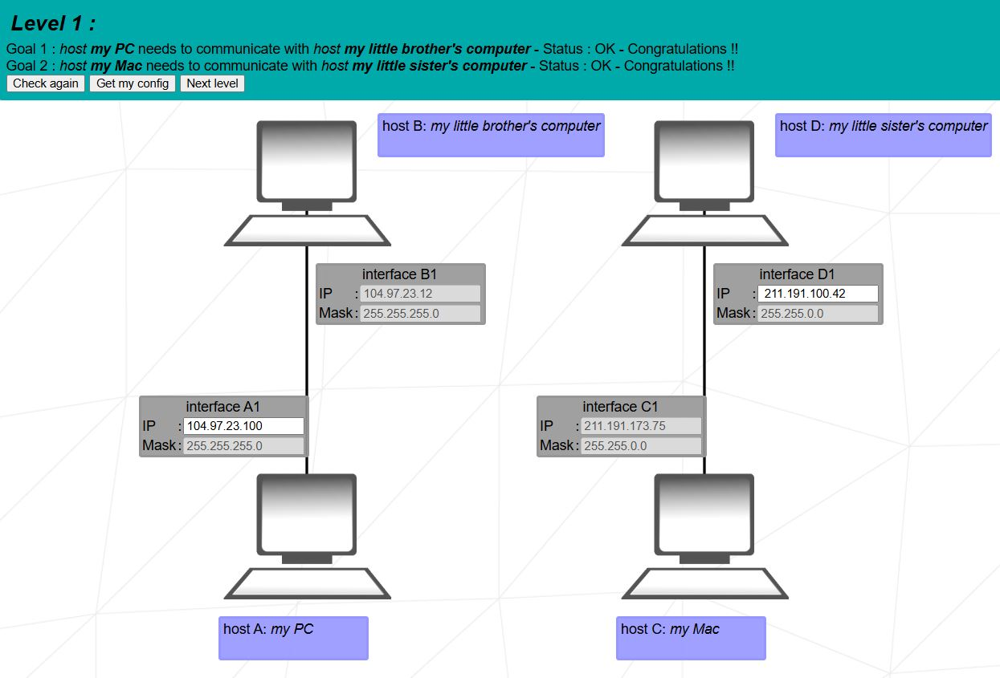
</details>

<details>
<summary> <h1>Nivel 2</h1></summary>

En este problema volvemos a tener dos redes separadas con dos equipos cada una, igual que en el nivel anterior.

## 🔹 Caso del equipo B

La máscara `255.255.255.32` no es válida, ya que `32` equivale a `00100000` en binario. Se solucionaría usando la misma máscara que el equipo A: `255.255.255.224`.

## 🔹 Caso del equipo A

Al tener ambos equipos la máscara `255.255.255.224` y contar el equipo B con la IP `192.168.61.222`, podemos calcular que está en la red `192.168.61.192`, cuyo rango de IPs es: (192.168.61.193 – 192.168.61.222)
Cualquier IP dentro de ese rango, excepto la que ya está ocupada por el equipo B, sería válida.

## 🔹 Caso de los equipos C y D

En este caso todo parece estar bien, ya que comparten la misma máscara (aunque en distintos formatos) y las IPs estarían dentro del rango. El problema es que la red `127.0.0.0/8` (`127.0.0.0 – 127.255.255.255`) está reservada para localhost o loopback y el tráfico no sale del equipo. Se puede solucionar asignando direcciones de otra red, por ejemplo `192.168.1.0` que con una máscara /30 tiene un rango de solo dos ips (`192.168.1.1` - `192.168.1.2`).

---

## 💻 Configuración de interfaces

```plaintext
Interface B1
🔒 IP:     192.168.61.222
✏️ Mask:   255.255.255.32 → 255.255.255.224 ✅

Interface A1
✏️ IP:     192.168.61.1 → 192.168.61.193 ✅
🔒 Mask:   255.255.255.224

Interface D1
✏️ IP:     127.0.0.4 → 192.168.1.1 ✅
🔒 Mask:   /30

Interface C1
✏️ IP:     127.0.0.1 → 192.168.1.2 ✅
🔒 Mask:   255.255.255.252
```
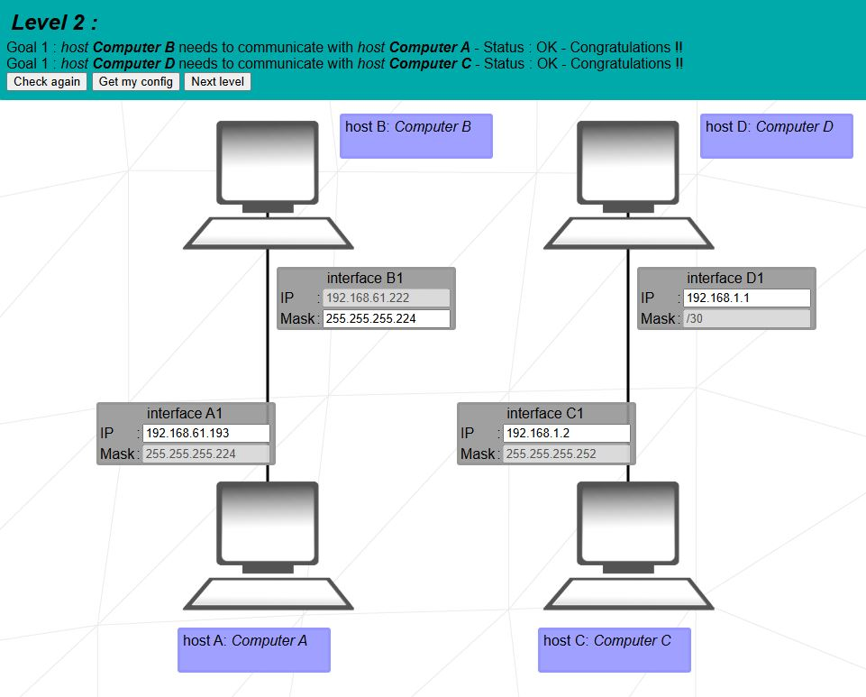
</details>

<details>
<summary> <h1>Nivel 3</h1></summary>

En este problema tenemos tres equipos conectados mediante un switch. Dado que solo están bloqueadas la IP del equipo A y la máscara del C, podemos calcular que la red que deben usar todos los equipos es `104.198.224.0/25`, con un rango de:  ( `104.198.224.1`  -  `104.198.224.126 `).


## 🔹 Caso del equipo A

Aunque lo más correcto y visual sería modificar la máscara por la más restringida (la del equipo C), es completamente innecesario y puede quedarse tal como está.

## 🔹 Caso del equipo B

En este caso cambiamos la IP por una que esté dentro del rango de la red calculada: `104.198.224.11`.  
_(En mi opinión, es buena práctica reservar las primeras 10 IPs de la red para la puerta de enlace y algún servidor.)_  
Al igual que en el caso del equipo A, la máscara puede quedarse tal como está.

## 🔹 Caso del equipo C

Igual que en el equipo B, solo hay que cambiar la IP por una dentro del rango: `104.198.224.12`.

---

## 💻 Configuración de interfaces

```plaintext
Interface A1
🔒 IP:     104.198.224.125
✏️ Mask:   255.255.255.0 ✅

Interface B1
✏️ IP:     127.168.42.42 → 104.198.224.11 ✅
✏️ Mask:   255.255.0.0 ✅

Interface C1
✏️ IP:     104.198.224.277 → 104.198.224.12 ✅
🔒 Mask:   255.255.255.128
```
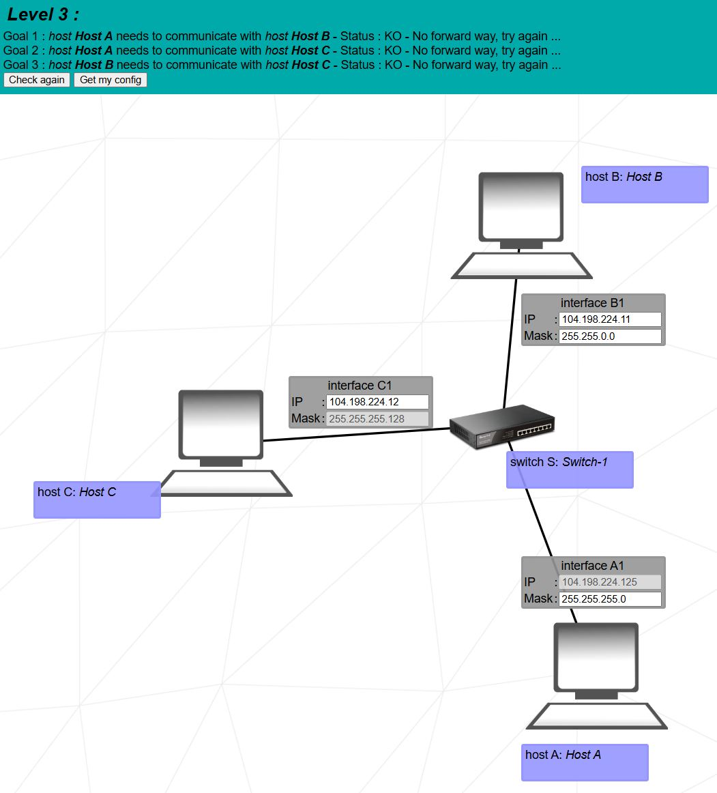

</details>

<details>
<summary> <h1>Nivel 4</h1></summary>

En este problema tenemos una red con dos equipos y un router conectados por un switch. El router tiene tres interfaces de red, por lo que podemos asumir que hay tres subredes. Parte del objetivo es que los equipos tengan conexión con toda la red y no solo entre ellos.

## 🔹 Caso del equipo A

Al tener la IP bloqueada y la máscara más alta de la subred, podemos calcular que la red es `80.121.117.128/28`, con un rango de:  (`80.121.117.129 - `80.121.117.142`). La máscara la dejamos tal como está.

## 🔹 Caso del equipo B

Solo hay que cambiar la IP por una que esté dentro del rango de la red `80.121.117.128/28` y, al ser la máscara menos restrictiva, puede quedarse tal como está.

## 🔹 Caso del router R1

En esta interfaz del router ocurre lo mismo que con el equipo B: asignar una IP dentro del rango calculado y mantener la máscara actual.

---

## 💻 Configuración de interfaces

```plaintext
Interface A1
🔒 IP:     80.121.117.132
✏️ Mask:   255.255.255.240 ✅

Interface B1
✏️ IP:     80.121.126.193 → 80.121.117.133 ✅
✏️ Mask:   255.255.0.0 ✅

Interface R1
✏️ IP:     80.121.117.91 → 80.121.117.129 ✅
✏️ Mask:   /23 ✅

Interface R2
🔒 IP:     80.121.117.1
🔒 Mask:   255.255.255.128

Interface R3
🔒 IP:     80.121.117.244
🔒 Mask:   255.255.255.192
```


</details>

<details>
<summary> <h1>Nivel 5</h1></summary>

En este caso tenemos una red con dos equipos conectados a través de un router, pero con la diferencia de que entre el router y cada equipo hay una subred con rangos de IP totalmente distintos, que en teoría no pueden comunicarse entre sí directamente. 

Por eso, podemos utilizar **tablas de enrutamiento** para indicarle a los equipos que envíen todo el tráfico destinado a esas redes externas al router. El router se encargará de redirigir dicho tráfico correctamente hacia su destino.

## 🔹 Caso del equipo A

Al tener la IP bloqueada y la máscara del router, calculamos la red con la máscara del router `255.255.255.128`, que es la más restrictiva y nos da dirección de red `23.244.128.0` con un rango de (23.244.128.1 – 23.244.128.126); ponemos una IP dentro de ese rango al equipo y dejamos la máscara tal cual. En la tabla de enrutamiento `default` ponemos `0.0.0.0/0`, lo que redirige todo el tráfico hacia donde le indiquemos, así que lo redirigimos todo al router `23.244.128.126`.

## 🔹 Caso del equipo B

Al tener la IP bloqueada y la máscara del router, calculamos la red con la máscara `/28`, que es la más restrictiva y nos da dirección de red `157.115.166.240` con un rango de (`157.115.166.241` – `157.115.166.254`); ponemos una IP dentro de ese rango al equipo y dejamos la máscara tal cual. En la tabla de enrutamiento `default` es igual que poner `0.0.0.0/0`, lo que redirige todo el tráfico hacia donde le indiquemos, así que lo redirigimos todo al router `157.115.166.254`.

---

## 💻 Configuración de interfaces

```plaintext
Interface A1
✏️ IP:     104.198.14.2 → 23.244.128.1 ✅
✏️ Mask:   255.255.255.0 → 255.255.255.128 ✅

Machine A Routes 
✏️10.0.0.0/8  => ✏️192.168.0.254 → 0.0.0.0/0 => 23.244.128.126 ✅

Interface B1
✏️ IP:     192.168.42.42 → 157.115.166.251 ✅
✏️ Mask:  /28 ✅

Machine B Routes 
🔒default  => ✏️192.168.0.254 → default  => 157.115.166.254 ✅

Interface R1
🔒 IP:     23.244.128.126
🔒 Mask:  255.255.255.128

Interface R2
🔒 IP:     157.115.166.254
🔒 Mask:   255.255.192.0
```
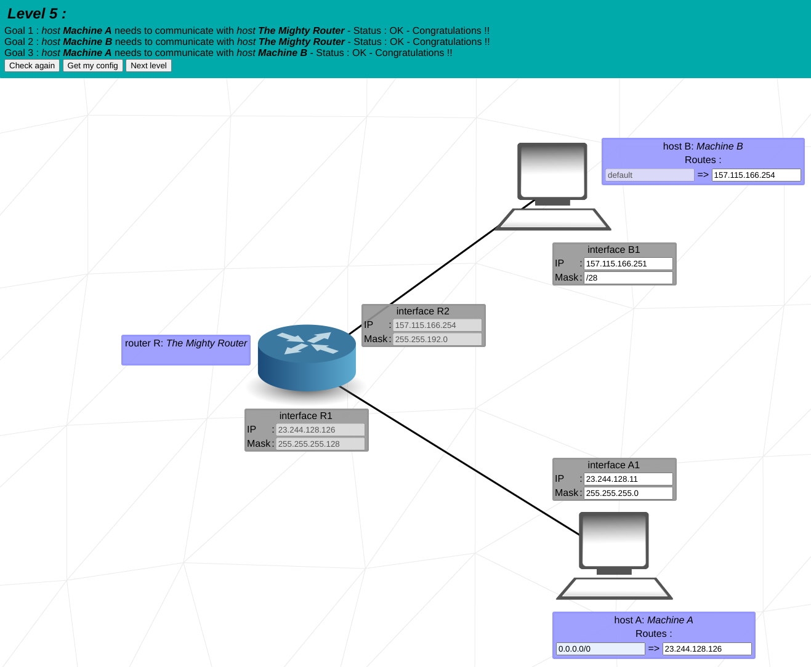

</details>

<details>
<summary> <h1>Nivel 6</h1></summary>

En este caso tenemos una red en la que un equipo se conecta a un router a través de un switch y, a su vez, el router se conecta a Internet.

## 🔹 Caso del equipo A

Dada su IP y su máscara, está dentro del rango del router, así que tiene comunicación directa con él; solo corregimos la dirección de enrutamiento para que apunte al router `58.13.5.254`.

## 🔹 Caso del router R

Su IP y su máscara se quedan como están, y en la tabla de enrutamiento redirigimos todo el tráfico a Internet poniendo `0.0.0.0/0`.

## 🔹 Caso de Internet

En la tabla de enrutamiento de lo que imagino es el servidor o el destino en Internet, redirigimos todo el tráfico de respuesta a nuestra red local `58.13.5.128/25` hacia la IP pública del router `163.172.250.12`.

---

## 💻 Configuración de interfaces

```plaintext
Interface A1
🔒 IP:     58.13.5.227
✏️ Mask:   255.255.255.0 ✅

Machine A Routes 
✏️ 0.0.0.0/0  => ✏️ 58.13.5.1 → 0.0.0.0/0  => 58.13.5.254 ✅

Interface R1
✏️ IP:     58.13.5.254 ✅
🔒 Mask:   255.255.255.128

Interface R2
🔒 IP:     163.172.250.12
🔒 Mask:   255.255.255.128

Router R Routes 
✏️ 10.0.0.0/8  => 🔒 163.172.250.1 → 0.0.0.0/0 => 163.172.250.1 ✅

Router R Routes 
✏️ 58.13.5.0/31  => 🔒 163.172.250.12 → 58.13.5.128/25 => 163.172.250.12 ✅
```

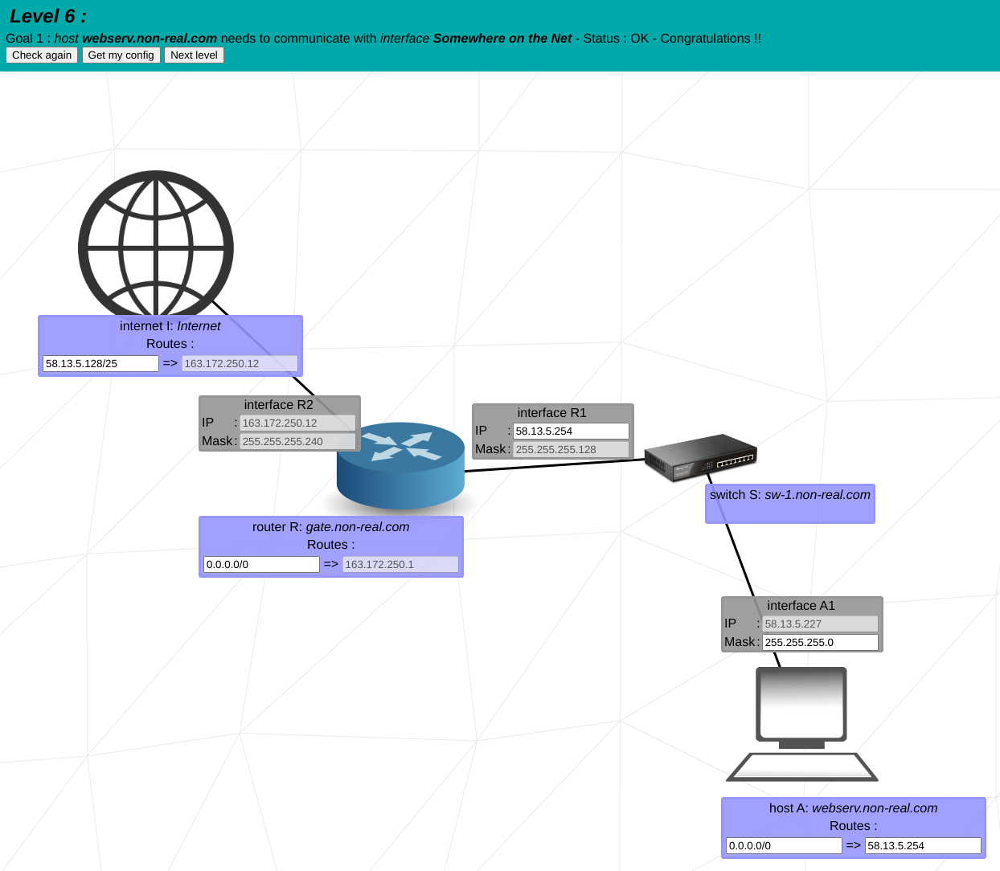

</details>

<details>
<summary> <h1>Nivel 7</h1></summary>

En este caso, tenemos una red con **dos equipos**, cada uno conectado a un router. A su vez, los routers están conectados entre sí. Entre cada router y su respectivo equipo hay una subred, y entre los dos routers hay otra, lo que nos deja **tres subredes**.

Debido a que en el **router 1**, las dos interfaces con las que se conecta tienen las **IP bloqueadas** y son **iguales hasta la máscara /24**, lo más sensato sería incrementar **en 2 la máscara** para crear **4 subredes**, ya que es lo mínimo que podemos subdividir para cubrir las tres subredes.

### Subnetting Aplicado
Aplicando **subnetting** sobre la red **111.198.14.0/24**, con un rango de **(111.198.14.1 - 111.198.14.254)**, creamos **4 nuevas subredes**:

- **111.198.14.0/26** con un rango de **(111.198.14.1 - 111.198.14.62)**
- **111.198.14.64/26** con un rango de **(111.198.14.65 - 111.198.14.126)**
- **111.198.14.128/26** con un rango de **(111.198.14.129 - 111.198.14.190)**
- **111.198.14.192/26** con un rango de **(111.198.14.193 - 111.198.14.254)**

## 🔹 Caso del equipo A

En este caso, la IP del router en la subred es `111.198.14.1/26` y el equipo A mantiene la IP `111.198.14.2`. Solo cambiamos la máscara de `255.255.255.0` a `255.255.255.192` (/26) para quedar en la subred `111.198.14.0/26`. Configuramos la ruta por defecto para que todo el tráfico hacia la subred del equipo C (`111.198.14.64/26`) u otras redes se envíe al router:

## 🔹 Caso del equipo C

En este caso, la IP del router en la subred de Equipo C es `111.198.14.129/26` y el equipo C mantiene la IP `111.198.14.130`. Solo cambiamos la máscara a `255.255.255.192` (/26) para quedar en la subred `111.198.14.128/26`. Configuramos la ruta por defecto para que todo el tráfico hacia otras subredes (p. ej. la subred de Equipo A `111.198.14.0/26`) se envíe al router:

## 🔹 Caso del router 1

IP preasignadas: 111.198.14.1/26 (hacia Equipo A) y 111.198.14.65/26 (hacia Router 2), ambas con máscara 255.255.255.192.  
Enrutamiento:
- Ruta directa a 111.198.14.0/26 (subred Equipo A).  
- Ruta directa a 111.198.14.64/26 (enlace a Router 2).  
- Ruta a 111.198.14.128/26 (subred Equipo C) vía 111.198.14.66 (IP de Router 2).

## 🔹 Caso del router 2

IP preasignadas: 111.198.14.66/26 (hacia Router 1) y 111.198.14.129/26 (hacia Equipo C), ambas con máscara 255.255.255.192.  
Enrutamiento:
- Ruta directa a 111.198.14.128/26 (subred Equipo C).  
- Ruta directa a 111.198.14.64/26 (enlace a Router 1).  
- Ruta a 111.198.14.0/26 (subred Equipo A) vía 111.198.14.65 (IP de Router 1).

---

## 💻 Configuración de interfaces

```plaintext
Interface A1
✏️ IP:      111.198.14.2
✏️ Máscara: 255.255.255.192 (/26)
✏️ Gateway: 111.198.14.1

Machine A - Rutas
✏️ Destino: 0.0.0.0/0  => Gateway: 111.198.14.1


---

## 💻 Configuración de interfaces

```plaintext
Interface A1
✏️ IP:     111.198.14.2 ✅
✏️ Mask:   255.255.255.0 → 255.255.255.192✅

Machine A Routes 
✏️ 0.0.0.0/0  => ✏️ 0.0.0.0 → 111.198.14.64/26 => 111.198.14.1✅ 

Interface C1
✏️ IP:     111.198.14.1 → 111.198.14.75 ✅
✏️ Mask:   255.255.255.0 → 255.255.255.192✅

Machine C Routes 
✏️ 0.0.0.0/0  => ✏️ 0.0.0.0 → 111.198.14.1/26 => 111.198.14.65 ✅

Interface R11
🔒 IP:     111.198.14.1 
✏️ Mask:   255.255.255.0 → 255.255.255.192✅

Interface R11
🔒 IP:     111.198.14.254 
✏️ Mask:   255.255.255.0 → 255.255.255.192✅

Router R1 Routes 
✏️ 0.0.0.0/0  => ✏️ 0.0.0.0 → 111.198.14.64/26 => 111.198.14.193 ✅

Interface R21
✏️ IP:     111.198.14.1 → 111.198.14.193✅
✏️ Mask:   255.255.255.0 → 255.255.255.192✅

Interface R22
✏️ IP:     111.198.14.254 →111.198.14.65✅
✏️ Mask:   255.255.255.0 → 255.255.255.192✅

Router R2 Routes 
✏️ 0.0.0.0/0  => ✏️ 0.0.0.0 → 111.198.14.1/26 => 111.198.14.254✅
```
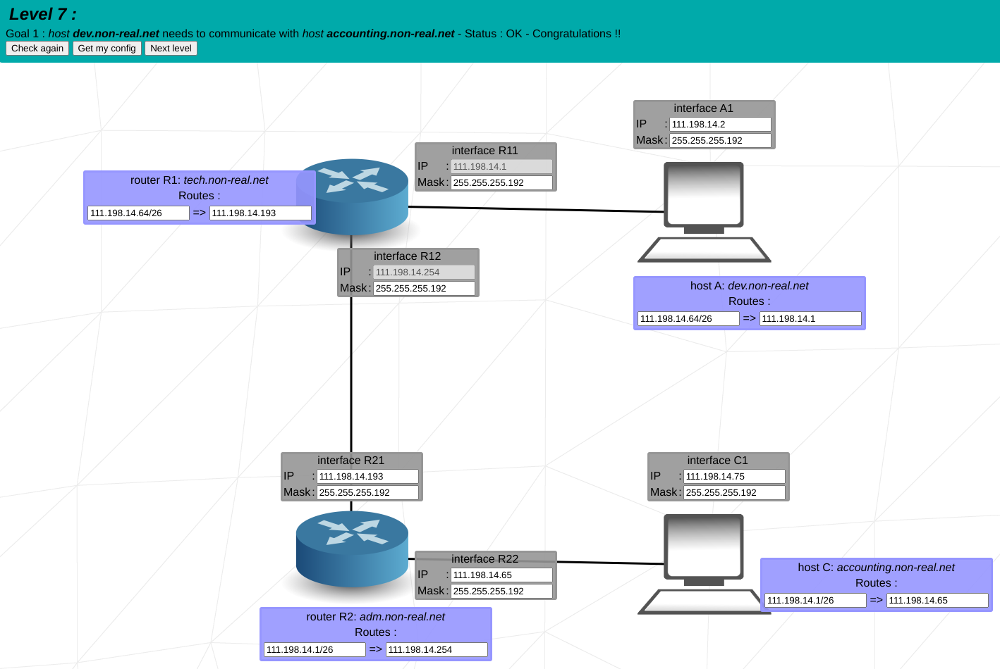

</details>

<details>
<summary> <h1>Nivel 8</h1></summary>

# After

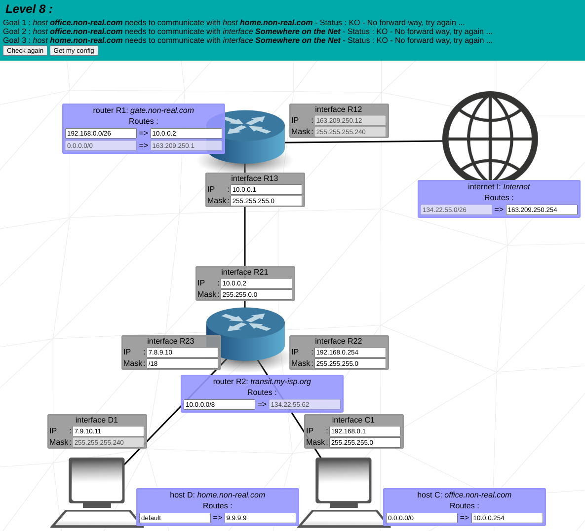

# Before

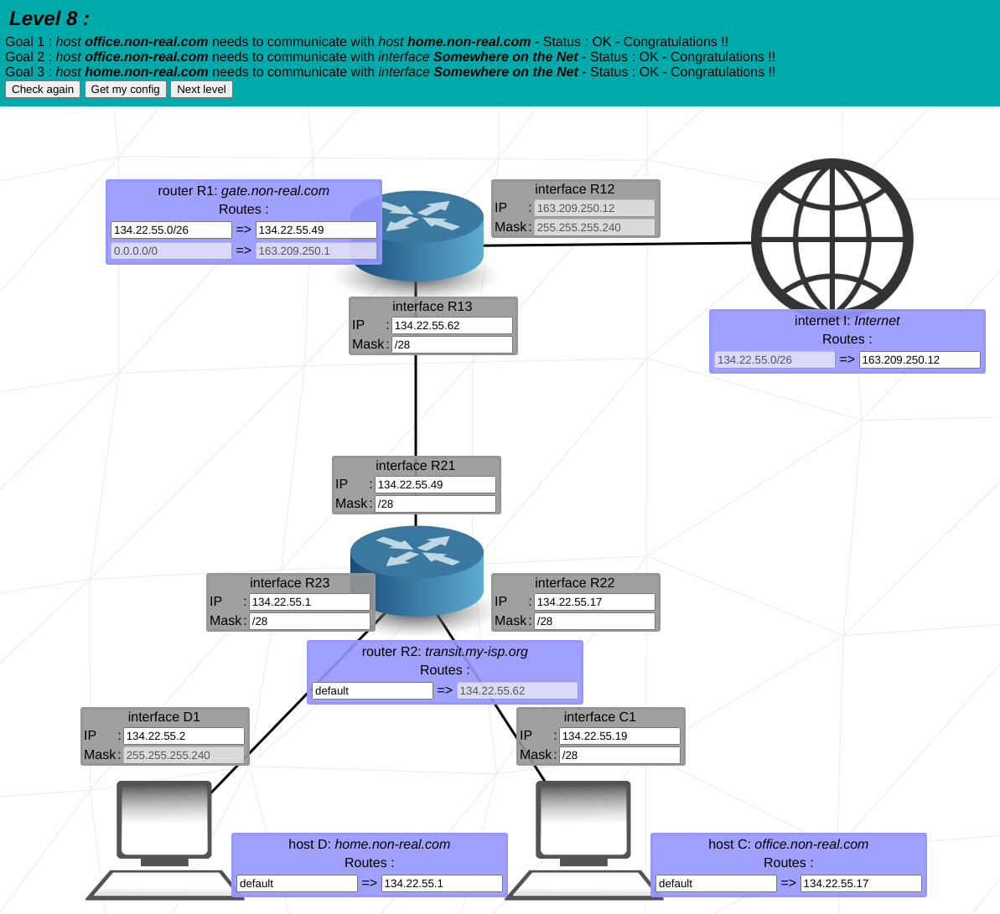

</details>

<details>
<summary> <h1>Nivel 9</h1></summary>

# After

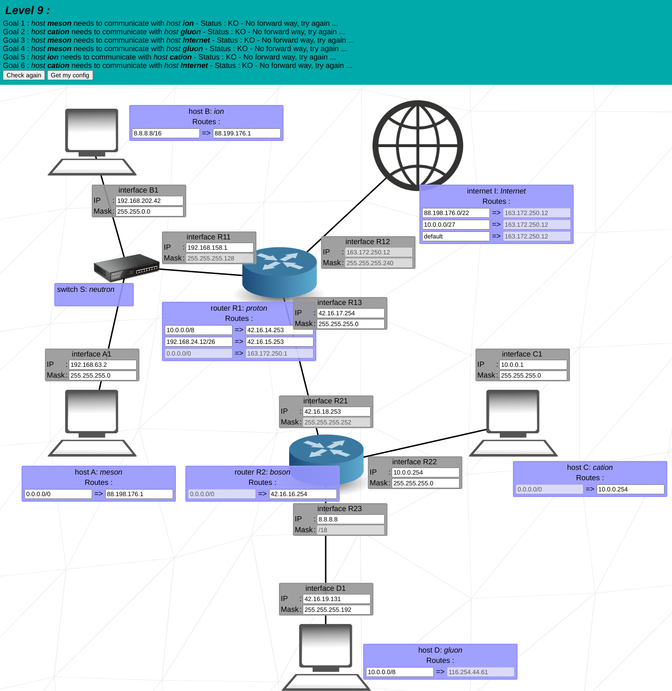

# Before

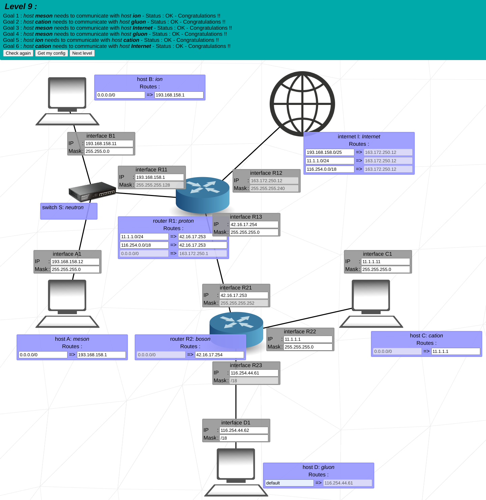

</details>

<details>
<summary> <h1>Nivel 10</h1></summary>

# After

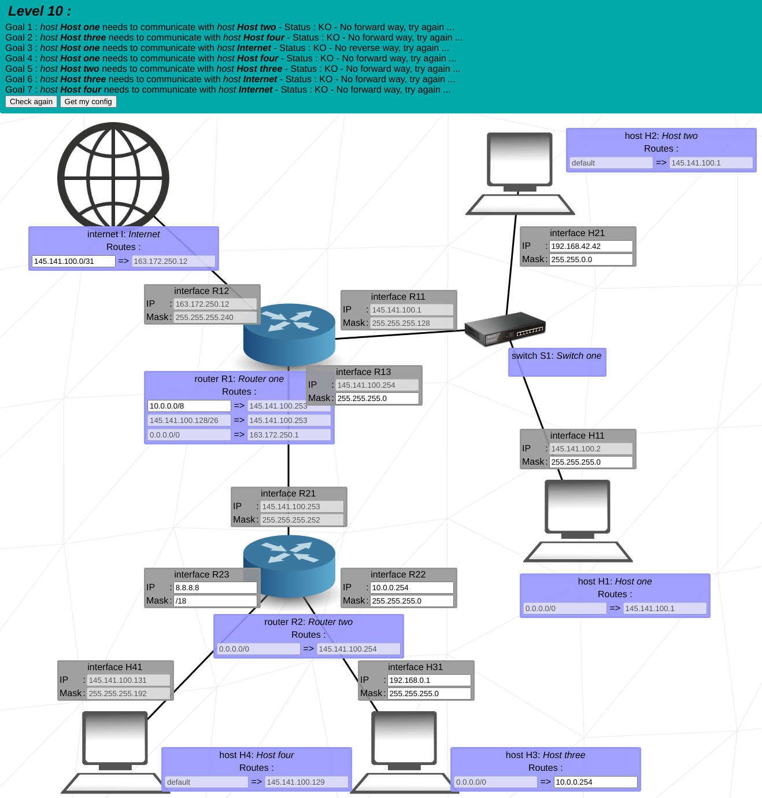

# Before


</details>