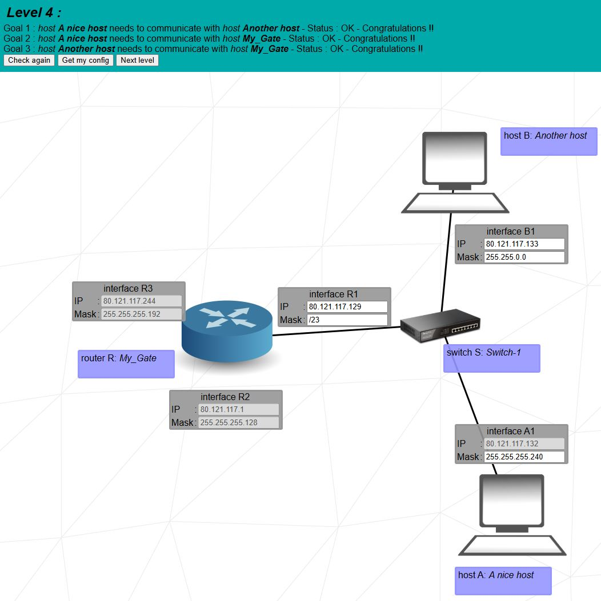

# 42_NetPractice
<details>
<summary> <h1>Nivel 1</h1></summary>

El problema que se presenta involucra **dos redes**, cada una con **dos equipos conectados entre sí**. En cada red, **uno de los equipos está correctamente configurado**, mientras que el otro tiene una **IP no válida**, ya que alguno de sus **octetos supera el valor máximo permitido (255)**.

## 🔹 Caso del equipo A

Dada su máscara `255.255.255.0`, el rango de direcciones IP posibles es: (`104.97.23.1` – `104.97.23.254`). 
El valor `293` no es un octeto válido, **principalmente porque supera los 8 bits en binario** (el valor máximo es 255). Además, **está fuera del rango de red**, ya que su red actual es `104.93.23.0`, mientras que debería pertenecer a la **misma red que el equipo B1**, es decir: `104.97.23.0`.

## 🔹 Caso del equipo D

Con una máscara `255.255.0.0`, el rango de IPs posibles es: (`211.191.0.1` – `211.191.255.254`). 
Al igual que en el ejemplo anterior, `319` **no es un octeto válido**, ya que excede el valor máximo permitido (255). Además, la IP original del equipo D1 pertenece a la red `211.190.0.0`, mientras que debería coincidir con la red del equipo **C1**, que es `211.191.0.0`.

---

## 💻 Configuración de interfaces

```plaintext
Interface B1
🔒 IP:     104.97.23.12
🔒 Mask:   255.255.255.0

Interface A1
✏️ IP:     104.93.23.293 → 104.97.23.100 ✅
🔒 Mask:   255.255.255.0

Interface D1
✏️ IP:     211.190.319.42 → 211.191.100.42 ✅
🔒 Mask:   255.255.0.0

Interface C1
🔒 IP:     211.191.173.75
🔒 Mask:   255.255.0.0
```

</details>

<details>
<summary> <h1>Nivel 2</h1></summary>

En este problema volvemos a tener dos redes separadas con dos equipos cada una, igual que en el nivel anterior.

## 🔹 Caso del equipo B

La máscara `255.255.255.32` no es válida, ya que `32` equivale a `00100000` en binario. Se solucionaría usando la misma máscara que el equipo A: `255.255.255.224`.

## 🔹 Caso del equipo A

Al tener ambos equipos la máscara `255.255.255.224` y contar el equipo B con la IP `192.168.61.222`, podemos calcular que está en la red `192.168.61.192`, cuyo rango de IPs es: (192.168.61.193 – 192.168.61.222)
Cualquier IP dentro de ese rango, excepto la que ya está ocupada por el equipo B, sería válida.

## 🔹 Caso de los equipos C y D

En este caso todo parece estar bien, ya que comparten la misma máscara (aunque en distintos formatos) y las IPs estarían dentro del rango. El problema es que la red `127.0.0.0/8` (`127.0.0.0 – 127.255.255.255`) está reservada para localhost o loopback y el tráfico no sale del equipo. Se puede solucionar asignando direcciones de otra red, por ejemplo `192.168.1.0` que con una máscara /30 tiene un rango de solo dos ips (`192.168.1.1` - `192.168.1.2`).

---

## 💻 Configuración de interfaces

```plaintext
Interface B1
🔒 IP:     192.168.61.222
✏️ Mask:   255.255.255.32 → 255.255.255.224 ✅

Interface A1
✏️ IP:     192.168.61.1 → 192.168.61.193 ✅
🔒 Mask:   255.255.255.224

Interface D1
✏️ IP:     127.0.0.4 → 192.168.1.1 ✅
🔒 Mask:   /30

Interface C1
✏️ IP:     127.0.0.1 → 192.168.1.2 ✅
🔒 Mask:   255.255.255.252
```

</details>

<details>
<summary> <h1>Nivel 3</h1></summary>

En este problema tenemos tres equipos conectados mediante un switch. Dado que solo están bloqueadas la IP del equipo A y la máscara del C, podemos calcular que la red que deben usar todos los equipos es `104.198.224.0/25`, con un rango de:  ( `104.198.224.1`  -  `104.198.224.126 `).


## 🔹 Caso del equipo A

Aunque lo más correcto y visual sería modificar la máscara por la más restringida (la del equipo C), es completamente innecesario y puede quedarse tal como está.

## 🔹 Caso del equipo B

En este caso cambiamos la IP por una que esté dentro del rango de la red calculada: `104.198.224.11`.  
_(En mi opinión, es buena práctica reservar las primeras 10 IPs de la red para la puerta de enlace y algún servidor.)_  
Al igual que en el caso del equipo A, la máscara puede quedarse tal como está.

## 🔹 Caso del equipo C

Igual que en el equipo B, solo hay que cambiar la IP por una dentro del rango: `104.198.224.12`.

---

## 💻 Configuración de interfaces

```plaintext
Interface A1
🔒 IP:     104.198.224.125
✏️ Mask:   255.255.255.0 ✅

Interface B1
✏️ IP:     127.168.42.42 → 104.198.224.11 ✅
✏️ Mask:   255.255.0.0 ✅

Interface C1
✏️ IP:     104.198.224.277 → 104.198.224.12 ✅
🔒 Mask:   255.255.255.128
```


</details>

<details>
<summary> <h1>Nivel 4</h1></summary>

En este problema tenemos una red con dos equipos y un router conectados por un switch. El router tiene tres interfaces de red, por lo que podemos asumir que hay tres subredes. Parte del objetivo es que los equipos tengan conexión con toda la red y no solo entre ellos.

## 🔹 Caso del equipo A

Al tener la IP bloqueada y la máscara más alta de la subred, podemos calcular que la red es `80.121.117.128/28`, con un rango de:  (`80.121.117.129 - `80.121.117.142`). La máscara la dejamos tal como está.

## 🔹 Caso del equipo B

Solo hay que cambiar la IP por una que esté dentro del rango de la red `80.121.117.128/28` y, al ser la máscara menos restrictiva, puede quedarse tal como está.

## 🔹 Caso del router R1

En esta interfaz del router ocurre lo mismo que con el equipo B: asignar una IP dentro del rango calculado y mantener la máscara actual.

---

## 💻 Configuración de interfaces

```plaintext
Interface A1
🔒 IP:     80.121.117.132
✏️ Mask:   255.255.255.240 ✅

Interface B1
✏️ IP:     80.121.126.193 → 80.121.117.133 ✅
✏️ Mask:   255.255.0.0 ✅

Interface R1
✏️ IP:     80.121.117.91 → 80.121.117.129 ✅
✏️ Mask:   /23 ✅

Interface R2
🔒 IP:     80.121.117.1
🔒 Mask:   255.255.255.128

Interface R3
🔒 IP:     80.121.117.244
🔒 Mask:   255.255.255.192
```


</details>

<details>
<summary> <h1>Nivel 5</h1></summary>

En este caso tenemos una red con dos equipos conectados a través de un router, pero con la diferencia de que entre el router y cada equipo hay una subred con rangos de IP totalmente distintos, que en teoría no pueden comunicarse entre sí directamente. 

Por eso, podemos utilizar **tablas de enrutamiento** para indicarle a los equipos que envíen todo el tráfico destinado a esas redes externas al router. El router se encargará de redirigir dicho tráfico correctamente hacia su destino.

## 🔹 Caso del equipo A

Al tener la IP bloqueada y la máscara del router, calculamos la red con la máscara del router `255.255.255.128`, que es la más restrictiva y nos da dirección de red `23.244.128.0` con un rango de (23.244.128.1 – 23.244.128.126); ponemos una IP dentro de ese rango al equipo y dejamos la máscara tal cual. En la tabla de enrutamiento `default` ponemos `0.0.0.0/0`, lo que redirige todo el tráfico hacia donde le indiquemos, así que lo redirigimos todo al router `23.244.128.126`.

## 🔹 Caso del equipo B

Al tener la IP bloqueada y la máscara del router, calculamos la red con la máscara `/28`, que es la más restrictiva y nos da dirección de red `157.115.166.240` con un rango de (`157.115.166.241` – `157.115.166.254`); ponemos una IP dentro de ese rango al equipo y dejamos la máscara tal cual. En la tabla de enrutamiento `default` es igual que poner `0.0.0.0/0`, lo que redirige todo el tráfico hacia donde le indiquemos, así que lo redirigimos todo al router `157.115.166.254`.

---

## 💻 Configuración de interfaces

```plaintext
Interface A1
✏️ IP:     104.198.14.2 → 23.244.128.1 ✅
✏️ Mask:   255.255.255.0 → 255.255.255.128 ✅

Machine A Routes 
✏️10.0.0.0/8  => ✏️192.168.0.254 → 0.0.0.0/0 => 23.244.128.126 ✅

Interface B1
✏️ IP:     192.168.42.42 → 157.115.166.251 ✅
✏️ Mask:  /28 ✅

Machine B Routes 
🔒default  => ✏️192.168.0.254 → default  => 157.115.166.254 ✅

Interface R1
🔒 IP:     23.244.128.126
🔒 Mask:  255.255.255.128

Interface R2
🔒 IP:     157.115.166.254
🔒 Mask:   255.255.192.0
```


</details>